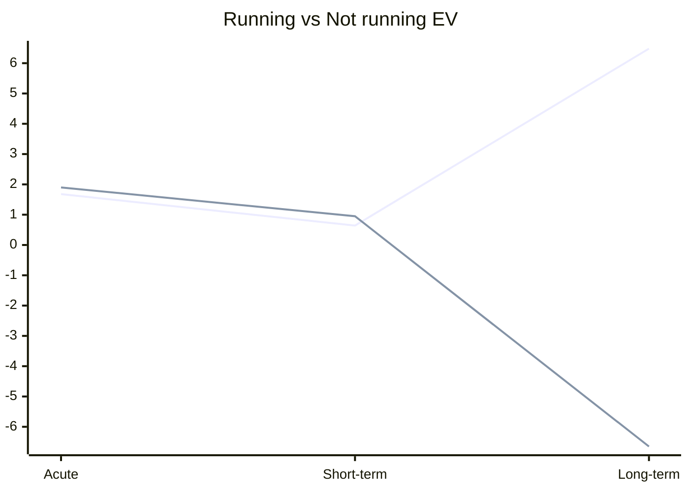

# How I calculate EV

Expected value is a common way to assess choices whilst including probability, in my personal life I use a slightly modified (and exhaustive) version that I think yields better results.

Imagine you’re playing a game where:

- You can win  $1, $2,  or  $3
- The probabilities of these outcomes are  0.2, 0.5  and  0.3.

The expected value is calculated as:
```
E(X) = 1 * 0.2 + 2 * 0.5 + 3 * 0.3
ExpectedValue = event1value * event1probability (etc)
```

### My modified Formula

My formula has several basic forms

- EV with acute, short term and long term all being equal
- EV with timespans being weighted (sometimes short term and acute benefit can be more valuable)

---

- P = Probablity (respresented as a decimal percentage 80% = 0.8, 65% = 0.65)
- AV = Acute value (1 week)
- SV = Short term value (1-3 Months)
- LV = Long term value (1 year)
- W = Weights (personal importance)

#### EV Unweighted

| Outcome | P    | AV   | SV   | LV   |
| ------- | ---- | ---- | ---- | ---- |
| 1       | 0.3  | 50   | 100  | 300  |
| 2       | 0.5  | 30   | 80   | 200  |
| 3       | 0.2  | 70   | 120  | 400  |

1. ```0.3*(50+100+300) = 135 ```
2. ```0.5*(30+80+200) = 155 ```
3. ```0.2*(70+120+400) = 118 ```

---

#### EV Weighted

| Outcome     | P    | AV   | SV   | LV   |
| ----------- | ---- | ---- | ---- | ---- |
| **Weights** | n/a  | 0.2  | 0.3  | 0.5  |
| 1           | 0.3  | 50   | 100  | 300  |
| 2           | 0.5  | 30   | 80   | 200  |
| 3           | 0.2  | 70   | 120  | 400  |

1. ``` 0.3*(0.2*50+0.3*100+0.5*300) = 57```
2. ``` 0.5*(0.2*30+0.3*80+0.5*200) =  67```
3. ``` 0.2*(0.2*70+0.3*120+0.5*400) = 50```

---

You can use these to assess choices individually or you can total them if you're assessing multiple outcomes for one choices

---

### Examples

#### Running

```mermaid
    xychart-beta
    title "Running"
    x-axis [Acute, Short-term, Long-term]
    line [0.15, 0.05, 0.80]
```

Now based on the benefits of running I care about about 80% of them are long term, 15% acute and 5% short term - In this example I'm going to use weights because the chance of sticking to running long term is lower than short term. I will also only be applying the weights to running since not running doesn't get more difficult with time, the weights applied to running are relative to how difficult it will be to do in each timeframe (all weights should sum to 1), for p it's the probability of getting the expected outcome as a decimal percentage. The values are going to be on a scale of -10 to 10, since we've already done the % value at each timeframe for running we can just represent them out of 10, the reason we could work out the %s at each timeframe is because the outcomes of running are fairly predictable.

| Outcome     | P    | AV   | SV   | LV   |
| ----------- | ---- | ---- | ---- | ---- |
| **Weights** | n/a  | 0.6  | 0.3  | 0.1  |
| Running     | 0.8  | 1.5  | 0.5  | 8    |
| Not running | 0.95 | 2    | 1    | -7   |

Now if we do the math

- Running: ```0.8*(0.6*1.5+0.3*0.5+0.1*8) = 1.48```
- Not Running: ```0.95*(2+1+-7)= -3.8```
- So now we can actually see broadly the difference in value between each, we can even see it more visually on a chart if we calculate the EV of each timeframe seperately


