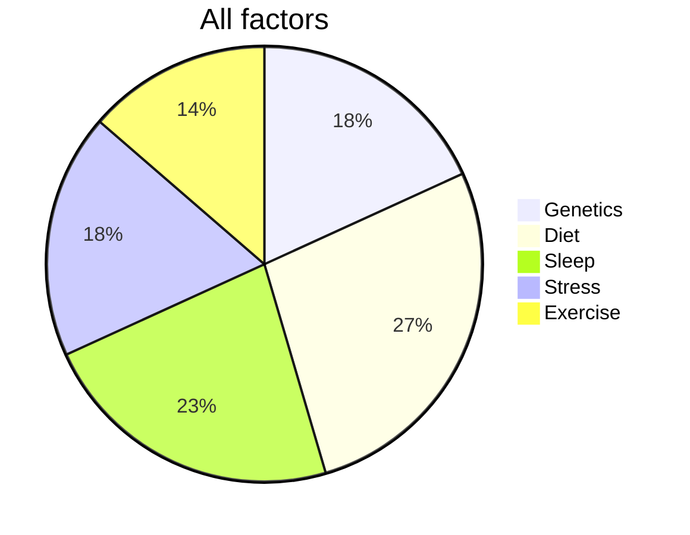
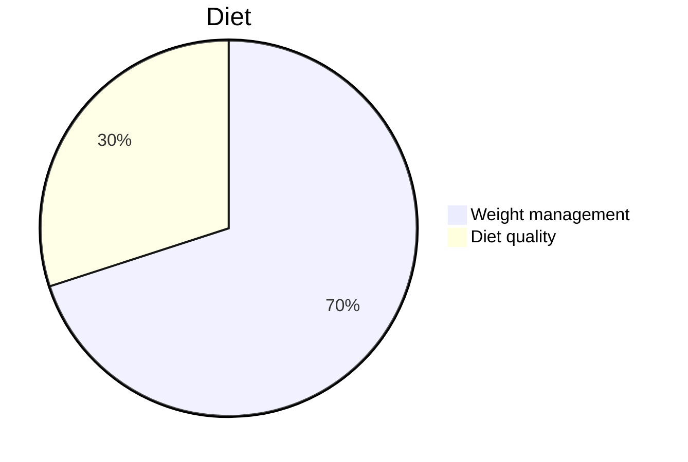
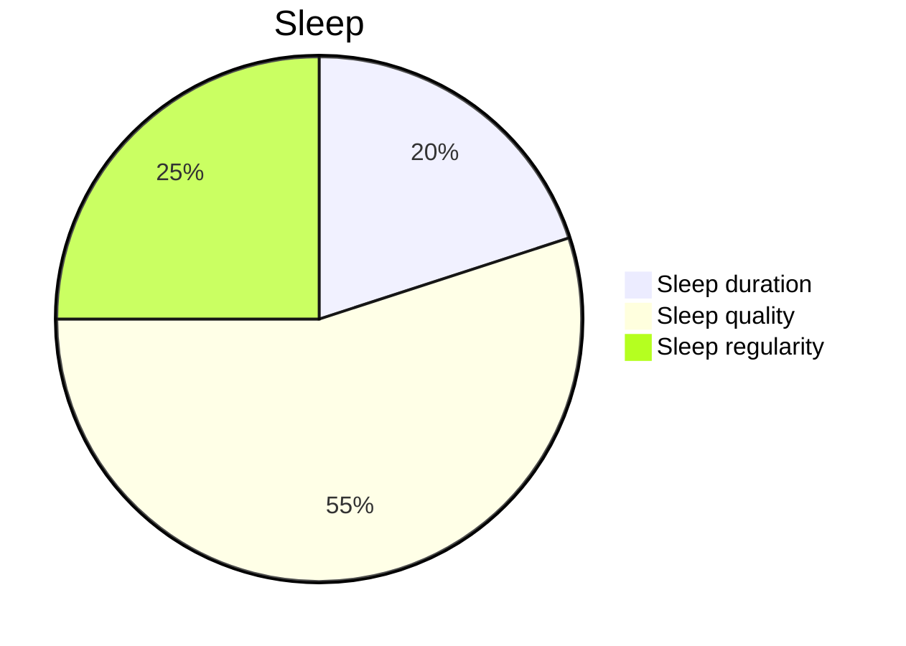
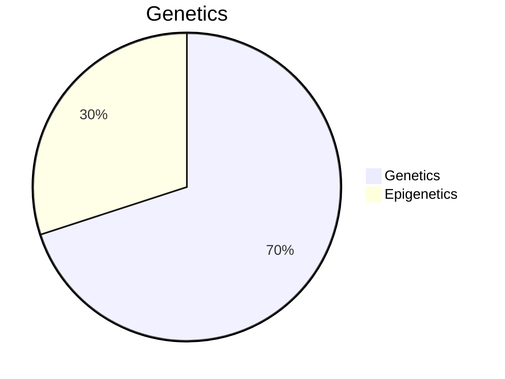
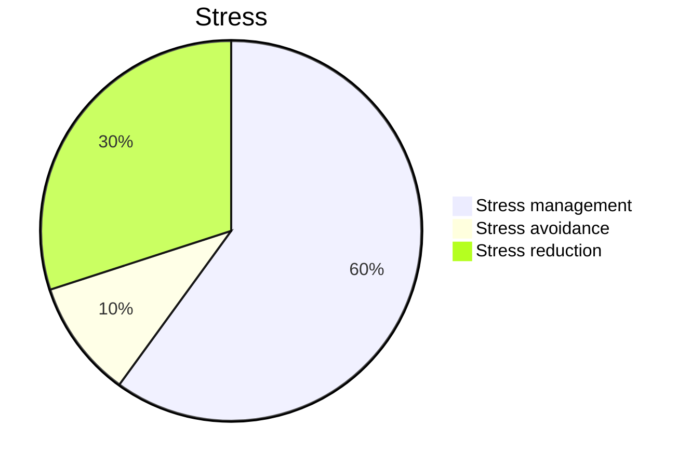
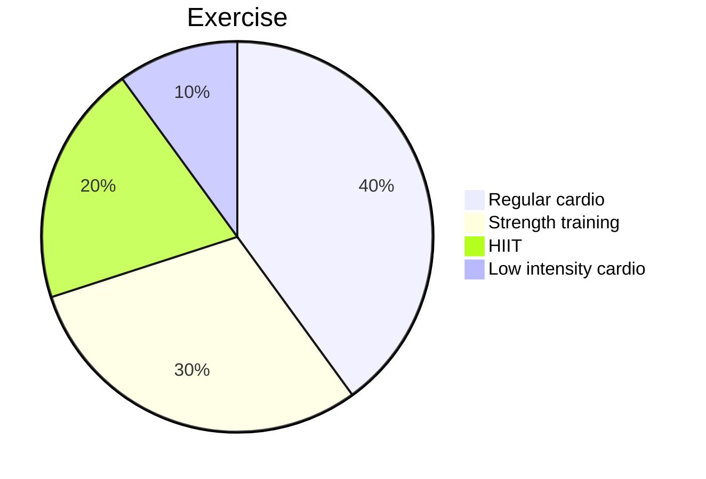

## All Factors

This is mostly just a look at the rough impact size of certain factors and behaviours on *health, longevity* and *wellbeing* - That's the scope it's not factoring in any personal goals or values you may have. It's use is to identify what to focus on and what are the highest yield levers you can pull for improvements in health, longevity and wellbeing.

## Diet

### Weight management

Obesity and being overweight cause so many downstream risks and harm that would significantly outweigh any benefit from a high quality diet (lots of fruit and veg, whole foods only) which makes it easy to prioritise over diet quality - if you want to know if you're the correct weight look up insurance height/weight tables for your country, they've got the maths down, then as long as you've got a reasonable amount of muscle mass you're fine.

### Diet Quality

Diet quality is not worthess by any stretch but it does seem to be focused on a lot more which is additionally ironic since it's not only a lot more effort but also requires much more discipline over time.

---

## Sleep

### Quality

Sleep quality is the backbone of good rest—it doesn’t matter how many hours you get if the sleep is fragmented or shallow, you’ll still feel awful. Deep, restorative sleep is what lets your body recover, regulate hormones, and function properly. Fixing your sleep quality is way more impactful than just sleeping longer or sticking to a schedule.

### Regularity

Sleep regularity is underrated but incredibly important. A consistent sleep schedule helps your body lock into its natural rhythm, which can make falling asleep easier and improve the overall efficiency of your sleep. It’s not as crucial as quality but definitely a step ahead of duration—it’s a lot easier to function on a few hours of regular sleep than a random mess of long, irregular nights.

### Duration

Getting enough sleep matters, but only to a point. If the quality is terrible or your schedule is chaotic, extra hours won’t save you. Duration is important for things like mental clarity and physical recovery, but compared to quality or regularity, it’s more of a nice-to-have than a must-have.

---

## Genetics

### Genetics

Your genetic makeup sets the foundation for your health—things like your predisposition to diseases, your metabolism, or how your body reacts to certain foods. But genetics are a fixed blueprint, not a guarantee, and they’re only part of the equation.

### Epigenetics

Epigenetics is where you actually have some control. The way your genes are expressed can be heavily influenced by your choices: what you eat, how you move, how much you sleep, and how stressed you are. This makes epigenetics a much higher priority than genetics—it’s the part of the equation you can actually do something about.

---

## Stress

### Management

Stress management is key when it comes to dealing with inevitable chaos. You can’t always avoid stress or make it magically disappear, but if you’ve got solid tools to handle it—like mindfulness, reframing situations, or good coping strategies—you can stop it from wrecking your health. It’s practical, sustainable, and makes the other approaches less important by comparison.

### Reduction

Stress reduction is great in theory but less reliable in practice. Sure, you can cut back on unnecessary commitments or simplify your life, but there’s always going to be stress you can’t avoid. It’s useful if you can identify and eliminate obvious stressors, but without good management skills, you’re not solving the root problem.

### Avoidance

Stress avoidance sounds nice, but it’s a short-term fix at best. You can’t sidestep stress forever, and trying to do so often creates new problems, like missed opportunities or avoiding challenges that could help you grow. Focus here only for stress that’s unnecessary and easily eliminated, but don’t make it your main strategy.

---

## Exercise

### Regular cardio

Regular cardio is vital for heart health. It keeps your cardiovascular system in check, lowers your risk of heart disease and stroke, and helps with overall endurance. Plus, it’s great for managing stress and boosting energy. It’s not as flashy as HIIT or as targeted as strength training, but it’s consistent and reliable—a solid foundation for long-term health.

### Strength training

Strength training is the all-around MVP. It builds and maintains muscle mass, improves bone density, and keeps your metabolism humming, which is critical as you age. While it doesn’t directly replace cardio for heart health, it’s the best thing you can do for functional fitness and preventing some types of age-related decline. If you’re looking for longevity and quality of life, this is where you put your focus.

### HIIT

HIIT is like cardio on steroids—time-efficient, great for improving cardiovascular fitness, and excellent for fat loss. But it’s intense, and not everyone can or should sustain it long-term. It’s best used as a bonus for people who already have a good fitness base or need quick results, but it’s not the cornerstone of a long-term health plan.

### Low intensity cardio

Low-intensity cardio is underrated. It’s not going to make you a fitness star, but it’s perfect for recovery, reducing stress, and staying active without overdoing it. Think of it as the steady baseline—it keeps you moving and benefits mental well-being, even if it’s not the most impactful for fitness or longevity on its own.
