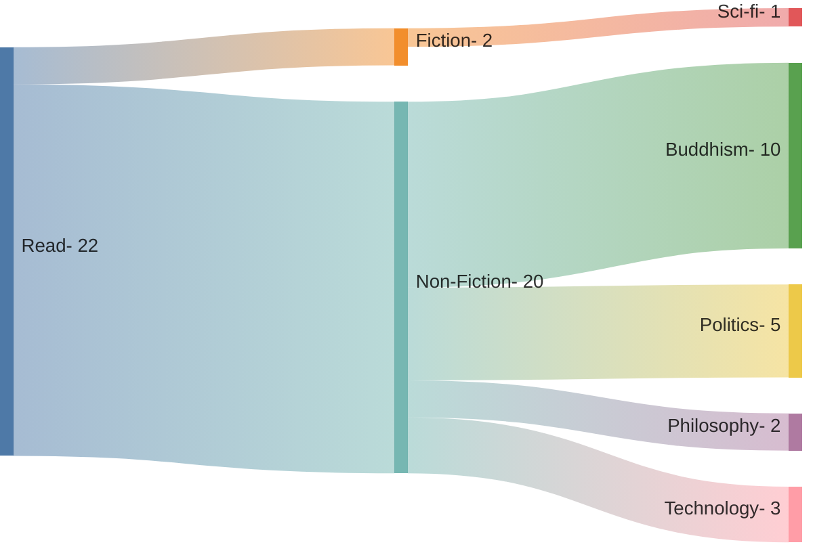

 <!-- truncate -->

## Logs

| Title                             | Category            |
| --------------------------------- | ------------------- |
| Pure Land, Jones                  | Buddhism, Pure Land |
| The life of milarepa              | Buddhism            |
| The buddhist and the ethicist     | Buddhism            |
| Meditations of the Pali Tradition | Buddhism, Theravada |
| Death was his koan                | Buddhism            |
| Entry into the inconceivable      | Buddhism            |
| The four sublime states           | Buddhism            |
| Dhammapada, Gil Fronsdal          | Buddhism            |
| Tales of a mad yogi               | Buddhism            |
| Warrior of zen                    | Buddhism            |
| Doing good better                 | Politics, Altruism  |
| Timenergy                         | Politics            |
| Communist Manifesto               | Politics            |
| Postcapitalist Desire             | Politics            |
| Age of anxiety                    | Politics            |
| Dune and philosophy, Decker       | Philosophy          |
| Mans search for meaning           | Philosophy          |
| Crypto Crackup, Bennington        | Technology          |
| The simulation unplugged, Zouev   | Technology          |
| Going infinite                    | Technology          |
| Dharma Bums                       | Fiction             |
| I, Robot, Asimov                  | Fiction, Sci-fi     |
