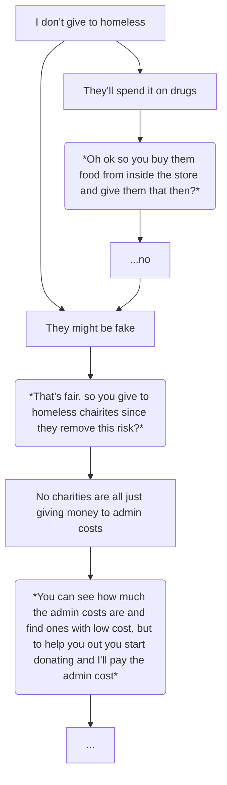

Instead of people admitting they don’t want to give away their money, they’ll pretend that it’s not that they aren’t altruistic, it’s that the altruism itself is flawed.

1. They’d just spend it on drugs
2. They’re probably faking it

These are the two most common arguments to not give to the homeless but both don’t stand up to simple conversational trees

(1) - In the winter month drug consumption increases among the homeless this is (in part) because sleeping horribly will kill you much quicker than drug consumption will, aside from that people who make claim (1) don’t buy the homeless food and if you suggest they do that they’ll instantly fumble there’s not a single additional claim worth addressing, whatever cliam they bring up can be overcome by suggesting they give to a charity that helps the homeless, they will then claim either (1a) charities are bloated or (1b) charities don’t help - in regards to (1a) there are tons of orginisations that vet charities so you can ensure the one you give to isn’t going to bloated administators (1b) there are also orgs that quantify how much “help” is provided per £ invested when confronted with this the person will make their final claim (1c) which is “it sounds like a lot of effort”/“I can’t do all that” at which point you offer to do it for them this will either end the conversation or they’ll take you up hoping it’s a bluff or that you won’t do it - if you have a charity that meets the spec ready to go you watch them cope in real time.

(2) - Ask them how many people do they think are faking it, if the number is less than 50% it’s still reasonable to donate since over half the time you’re helping a genuine homeless person, then ask them if homeless people are treated well - they will say no obviously then you follow up by asking how desperate for money would they have to be to resort to pretending to be homeless to beg for money - they will say extremely desperate which means over half the time you’re donating to the homeless and less than half you donating to someoen who is incredibly desperate for money (and is likely doing it as a last resort)

The reason for all this is because of a social pressure that implies an immorality goes along with not trying to help people you can help - this social pressure is mostly pointless since like singer laid out it could be reduced even further - each $ you spend on luxury goods for yourself could be donated and actually save peoples lives - but this isn’t as local as walking past a homeless person so no one feels a social pressure to pretend they care but they do feel a social pressure to pretend they want to help the homeless whilst making up obviously fake excuses as to why they don’t.

