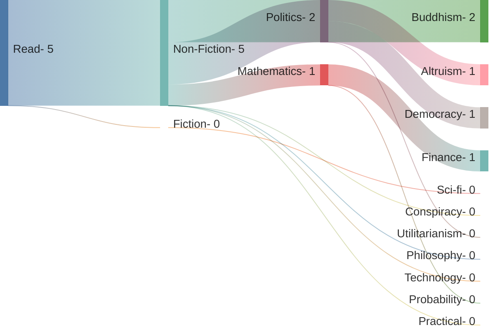
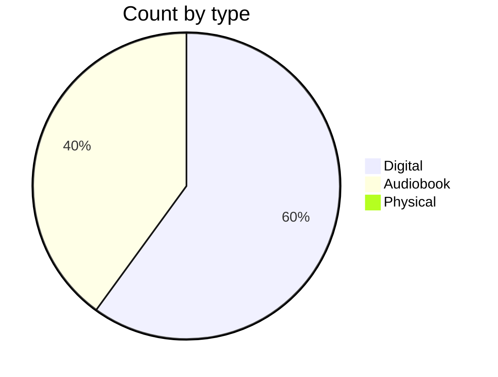
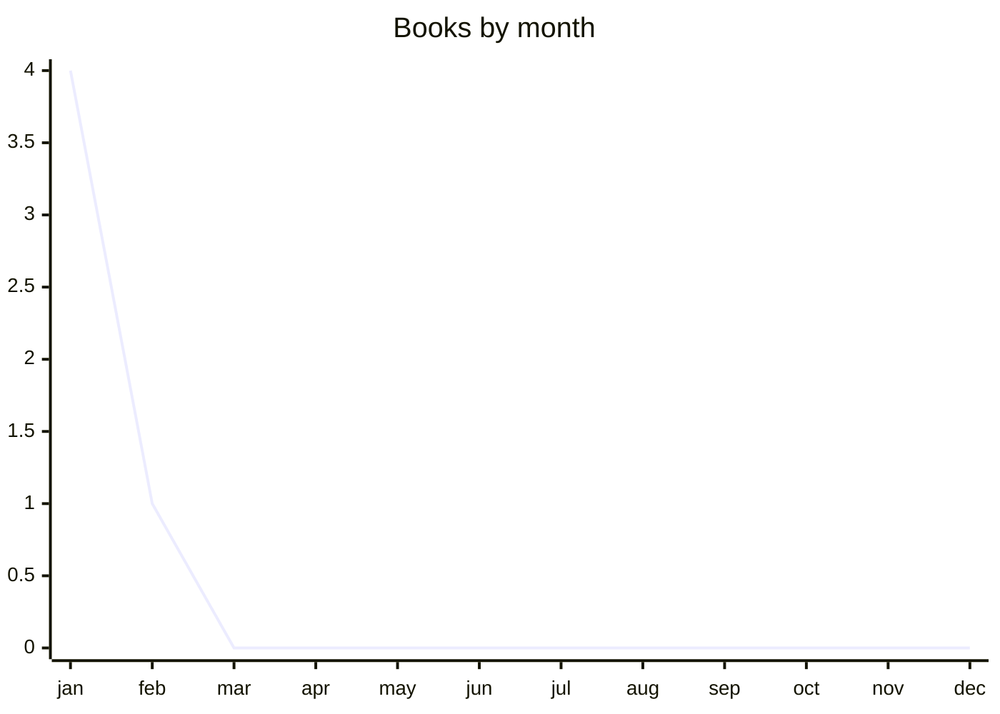

 <!-- truncate -->

I want to stress reading a lot is very much just consistency*time - the average book take 3-7 hours to read, if you read for 15 minutes when you wake up and 15 minutes before bed everyday for a year you'll read between 25-50 books per year, it's just consistency however as someone who reads a lot the fetishisation of reading is really dumb, generally books have low information density, high cost (in terms of money and time), I read because I enjoy it but unless you really enjoy reading you're better off learning from blog posts and youtube videos.

---

## Best of/note worthy

- **Effective Altruism, Magnus Vinding**: Brief and practical introduction to effective altruism
- 

## Log

| Date     | Title                                     | Category            | Rating | Type      |
| -------- | ----------------------------------------- | ------------------- | ------ | --------- |
| 01/01/25 | Effective Altruism, Magnus Vinding        | Politics, Altruism  | 8      | Digital   |
| 13/01/25 | Autocracy Inc                             | Politics, Democracy | 7      | Audiobook |
| 17/01/25 | a random walk down wallstreet             | Finance, Stocks     | 5      | Digital   |
| 22/01/25 | Essence of the Heart Sutra, Tenzin Gyatso | Buddhism            | 6      | Audiobook |
| 04/02/25 | Living Theravada                          | Buddhism, Theravada | 5      | Digital   |

## Blog posts/articles

This is not a log of all blog posts/articles I've read, it's just ones I think are particularly high value

| Title                                                        | Description                                                  |
| ------------------------------------------------------------ | ------------------------------------------------------------ |
| [There is no speed limit](https://sive.rs/kimo)              | You can probably push yourself way harder                    |
| [Sam altman - Productivity](https://blog.samaltman.com/productivity) | Effort post from sam altman about how to be productive       |
| [Be a new homunculus](https://www.lesswrong.com/posts/KGoNQZAnmfd4oDtfY/be-a-new-homunculus) | How to reset baggage                                         |
| [Goal Factoring](https://www.lesswrong.com/posts/ZHWiCM4QmX8WwYajH/goal-factoring-1) | Makes the argument you can probably get everything you want more often than you realise |
|                                                              |                                                              |

