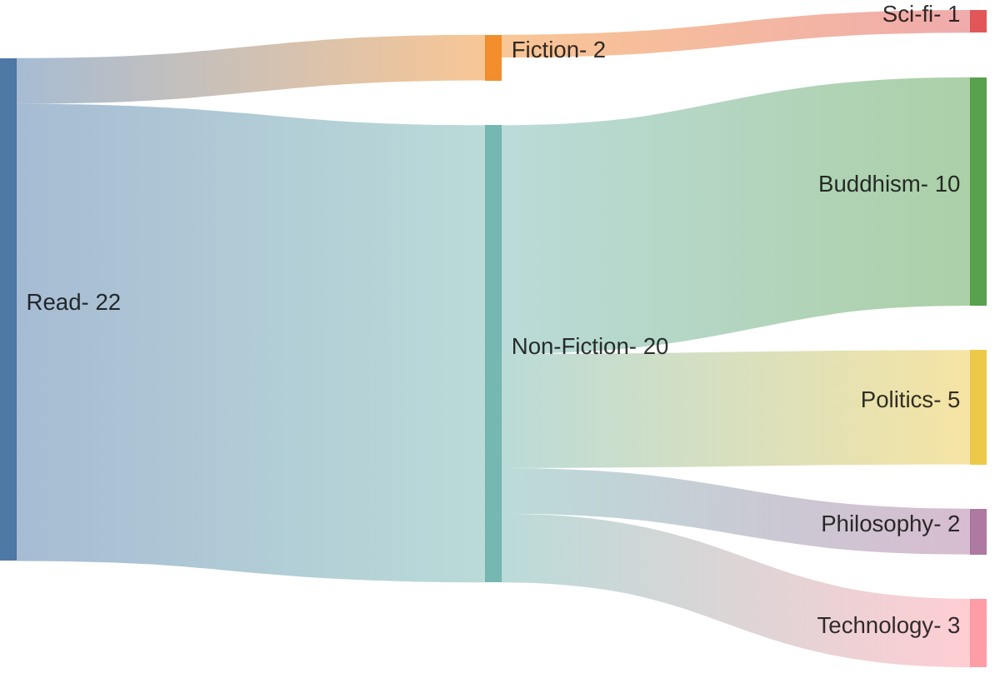

## Logs

### Buddhism

- Pure Land, Jones
- The life of milarepa
- The buddhist and the ethicist
- Meditations of the Pali tradition
- Death was his koan
- Entry into the inconceivable
- The four sublime states
- Dhammapada, Gil Fronsdal
- Tales of a mad yogi
- Warrior of zen

### Politics
- Doing good better
- Timenergy
- Communist Manifesto
- Postcapitalist Desire
- Age of anxiety

### Philosophy
- Dune and philosophy, Decker
- Mans search for meaning

### Technology
- Crypto Crackup, Bennington
- The simulation unplugged, Zouev
- Going infinite

### Fiction
- Dharma Bums
- I, Robot, Asimov
