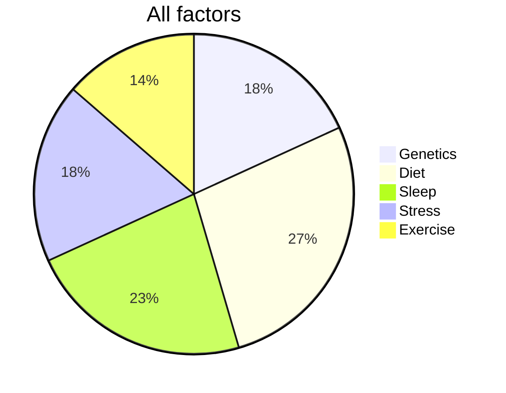
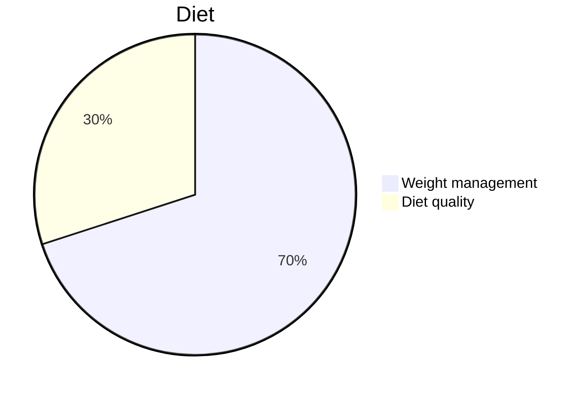
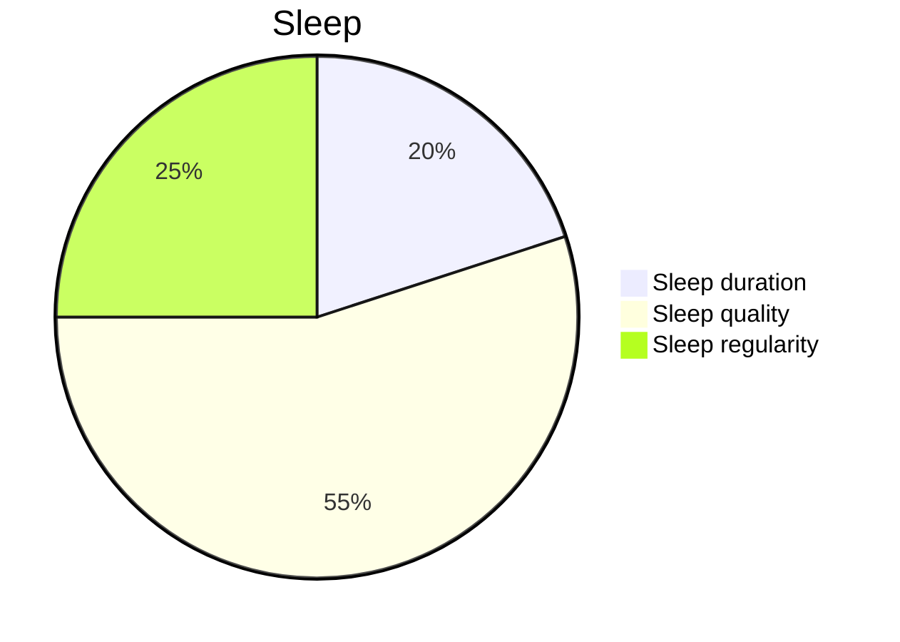
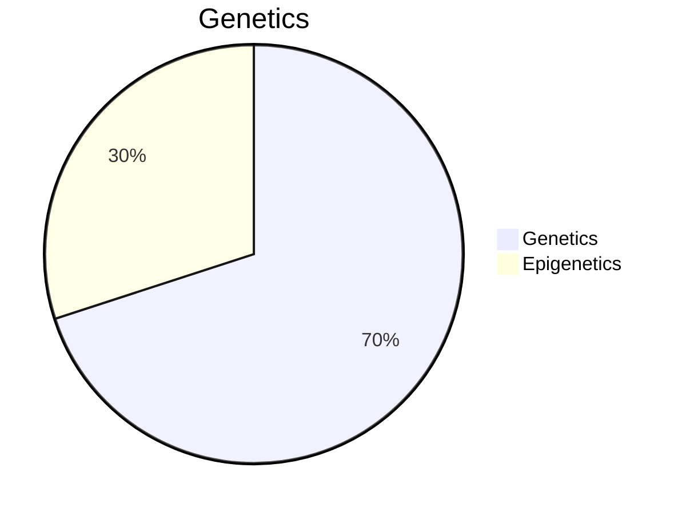
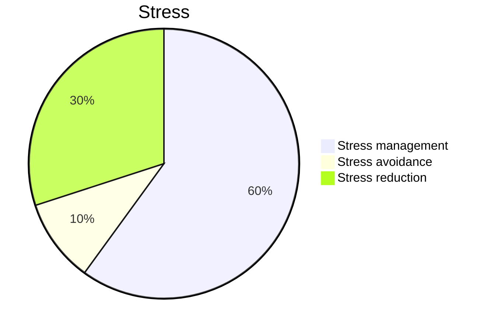
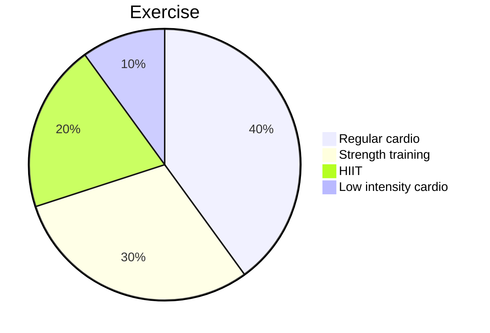

## All Factors

```mermaid
pie title All factors
    "Genetics" : 20
    "Diet" : 30
    "Sleep" : 25
    "Stress" : 20
    "Exercise" : 15
```

## Diet

```mermaid
pie title Diet
    "Weight management" : 70
    "Diet quality" : 30
```

## Sleep

```mermaid
pie title Sleep
    "Sleep duration" : 20
    "Sleep quality" : 55
    "Sleep regularity" : 25
```

## Genetics

``` mermaid
pie title Genetics
    "Genetics" : 70
    "Epigenetics" : 30
```

##

## Stress

```mermaid
pie title Stress
    "Stress management" : 60
    "Stress avoidance" : 10
    "Stress reduction" : 30
```

## Exercise

```mermaid
pie title Exercise
    "Regular cardio" : 40
    "Strength training" : 30
    "HIIT" : 20
    "Low intensity cardio" : 10
```

