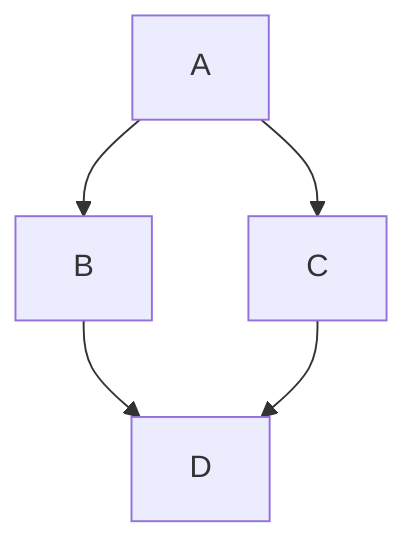
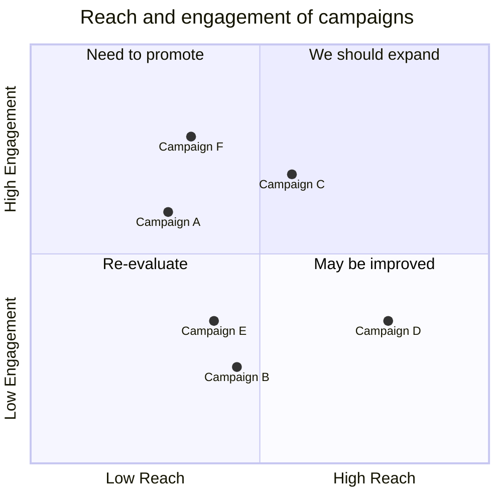
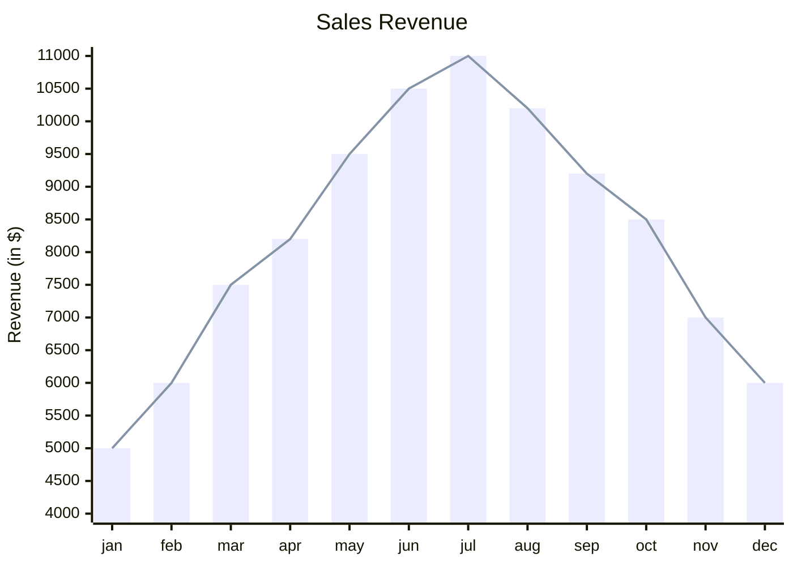
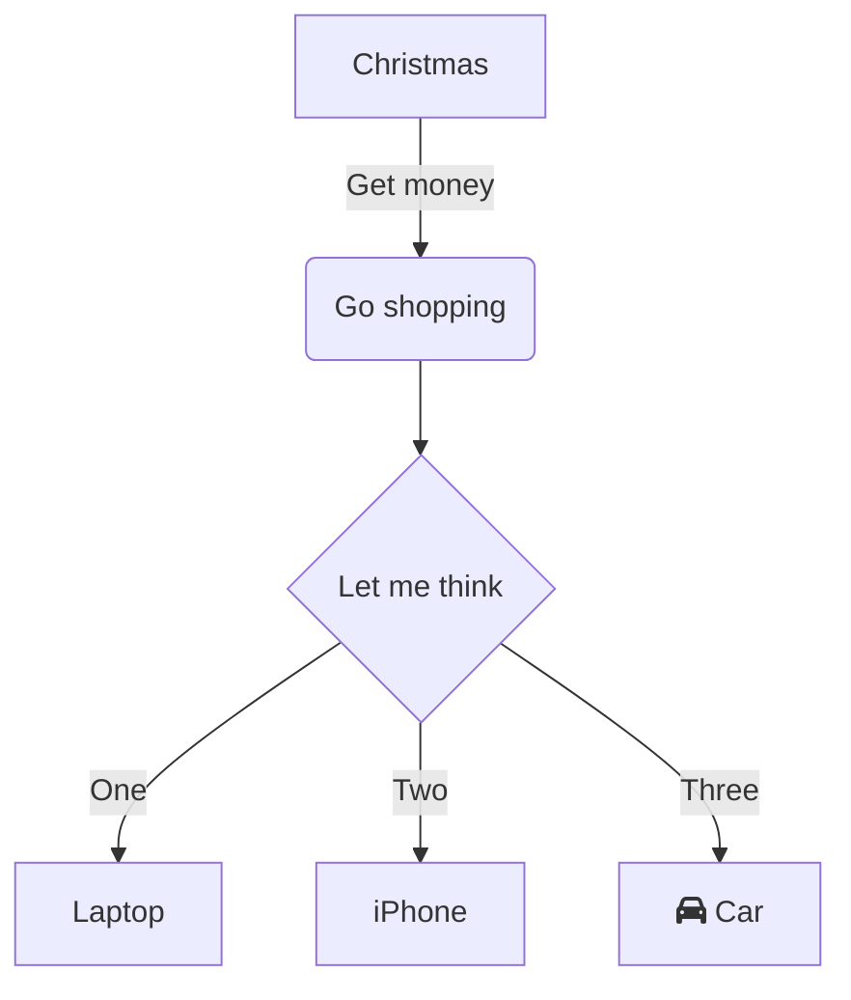
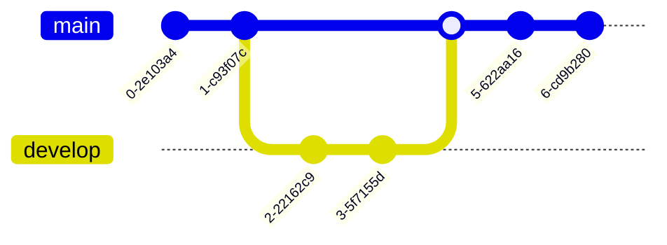
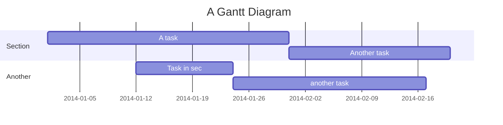
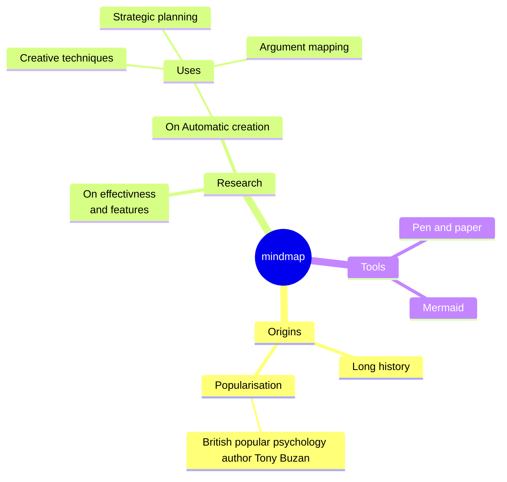
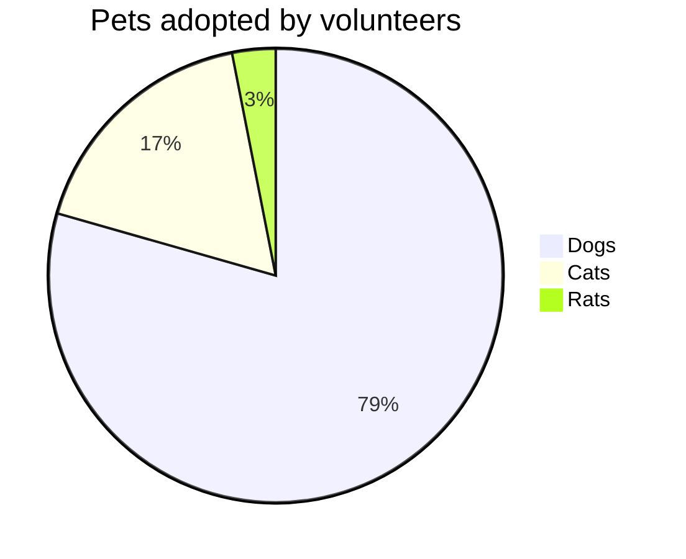

## Frontmatter
```
---
title:
authors:
tags: []
---


<!-- truncate -->
```

## Workflow
Updating the site
1. Push to main branch
```
git add .
git commit -m "Update docs"
git push origin main
```
2. Deploy to gh-pages branch
```
export GIT_USER=bippyboppy
npm run deploy
```

## Alerts
### Note
:::note
Here's some **information** with _Markdown_ styling.
:::
```
:::note
Here's some **information** with _Markdown_ styling.
:::
```
---
### Tip
:::tip
Here's a **helpful tip** with _formatted text_.
:::
```
:::tip
Here's a **helpful tip** with _formatted text_.
:::
```
---
### Info
:::info
Here's some **useful info** presented in a clear way.
:::
```
:::info
Here's some **useful info** presented in a clear way.
:::
```
---
### Caution
:::caution
Please take **extra caution** with this important note.
:::
```
:::caution
Please take **extra caution** with this important note.
:::
```
---
### Danger
:::danger
This is a **dangerous situation** you need to be aware of.
:::
```
:::danger
This is a **dangerous situation** you need to be aware of.
:::
```
---

:::note This is a _custom title_
And you can add images as well.

:::
```
:::note This is a _custom title_
And you can add images as well.

:::
```


## Tabs
```

import Tabs from '@theme/Tabs';
import TabItem from '@theme/TabItem';

<Tabs>
  <TabItem value="book" label="Book" default>
    Dive into the world of knowledge with a captivating book 📚
  </TabItem>
  <TabItem value="painting" label="Painting">
    Admire the strokes of artistry on a beautiful painting 🖼️
  </TabItem>
  <TabItem value="music" label="Music">
    Let the soothing melodies of music transport you 🎶
  </TabItem>
</Tabs>

I'm a text that doesn't belong to any tab. So I'm always visible.
```

## Mermaid Charts

### Graph

```
graph TD;
  A-->B;
  A-->C;
  B-->D;
  C-->D;
```


---
### Quadrant Chart
```
quadrantChart
    title Reach and engagement of campaigns
    x-axis Low Reach --> High Reach
    y-axis Low Engagement --> High Engagement
    quadrant-1 We should expand
    quadrant-2 Need to promote
    quadrant-3 Re-evaluate
    quadrant-4 May be improved
    Campaign A: [0.3, 0.6]
    Campaign B: [0.45, 0.23]
    Campaign C: [0.57, 0.69]
    Campaign D: [0.78, 0.34]
    Campaign E: [0.40, 0.34]
    Campaign F: [0.35, 0.78]
```



---
### XY Chart
```
    xychart-beta
    title "Sales Revenue"
    x-axis [jan, feb, mar, apr, may, jun, jul, aug, sep, oct, nov, dec]
    y-axis "Revenue (in $)" 4000 --> 11000
    bar [5000, 6000, 7500, 8200, 9500, 10500, 11000, 10200, 9200, 8500, 7000, 6000]
    line [5000, 6000, 7500, 8200, 9500, 10500, 11000, 10200, 9200, 8500, 7000, 6000]
```

---
### Flowchart
```
flowchart TD
    A[Christmas] -->|Get money| B(Go shopping)
    B --> C{Let me think}
    C -->|One| D[Laptop]
    C -->|Two| E[iPhone]
    C -->|Three| F[fa:fa-car Car]
```

---
### Git Graph
```
gitGraph
    commit
    commit
    branch develop
    checkout develop
    commit
    commit
    checkout main
    merge develop
    commit
    commit
```


---
### Gantt
```
gantt
    title A Gantt Diagram
    dateFormat  YYYY-MM-DD
    section Section
    A task           :a1, 2014-01-01, 30d
    Another task     :after a1  , 20d
    section Another
    Task in sec      :2014-01-12  , 12d
    another task      : 24d
```

---
### Mindmap
```
mindmap
  root((mindmap))
    Origins
      Long history
      ::icon(fa fa-book)
      Popularisation
        British popular psychology author Tony Buzan
    Research
      On effectivness<br/>and features
      On Automatic creation
        Uses
            Creative techniques
            Strategic planning
            Argument mapping
    Tools
      Pen and paper
      Mermaid
```

---
### Pie chart
```
pie title Pets adopted by volunteers
    "Dogs" : 386
    "Cats" : 85
    "Rats" : 15
```

---
