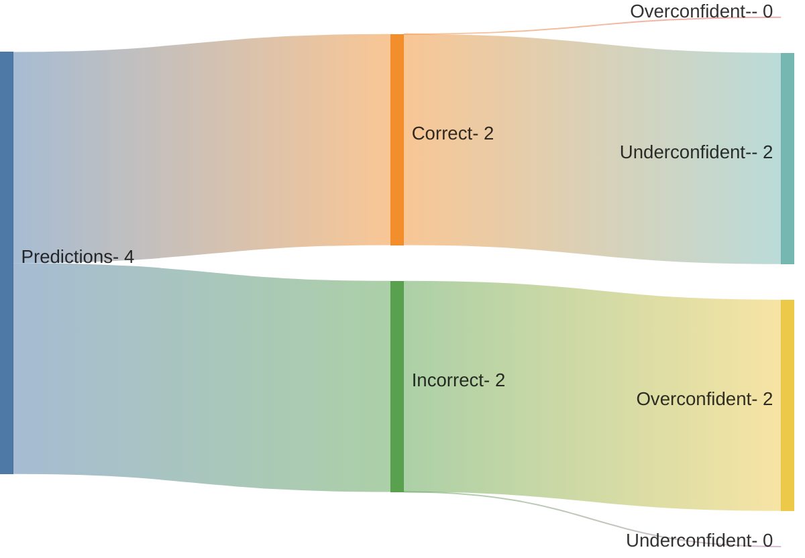

## Predictions by grouping

import Tabs from '@theme/Tabs';
import TabItem from '@theme/TabItem';

<Tabs>
  <TabItem value="Summary" label="Summary" default>
## Summary
- [55% Confidence <code>[/]</code> <code>[%]</code>](#orgb7ba1a4)
- [65% Confidence <code>[/]</code> <code>[%]</code>](#org0b162c6)
- [75% Confidence <code>[/]</code> <code>[%]</code>](#org58aec5a)
- [85% Confidence <code>[0/1]</code> <code>[0%]</code>](#orga10afb1)
- [95% Confidence <code>[2/2]</code> <code>[100%]</code>](#orgb45a72d)

The workflow for predictions isn't that clean but I try to keep it updated
  </TabItem>
  <TabItem value="rawdata" label="Raw Data">
The [raw data](https://raw.githubusercontent.com/bippyboppy/bippyboppy.github.io/refs/heads/main/docs/predictions.org) is kept in an org file on the main branch, any predictions about personal life are usually using a shorthand
  </TabItem>
</Tabs>

- Being over/under confidence is obviously a bad thing, things rarely improve without a feedback mechanism
