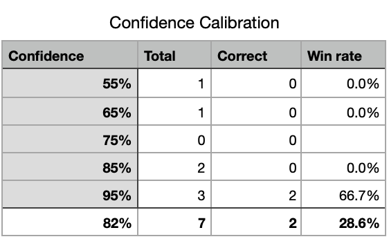

## What is this?

The concept is simple, log your predictions and you confidence then know if you're over/under confident - if you're correctly confident your win rate should be 1:1 with your confidence 55% of your predictions that you're 55% confident about should be correct.

Obviously it's a bad thing in life to be under/over confident and if you don't log it you can't hold yourself accountable.

## Prediction callibration scores

---
