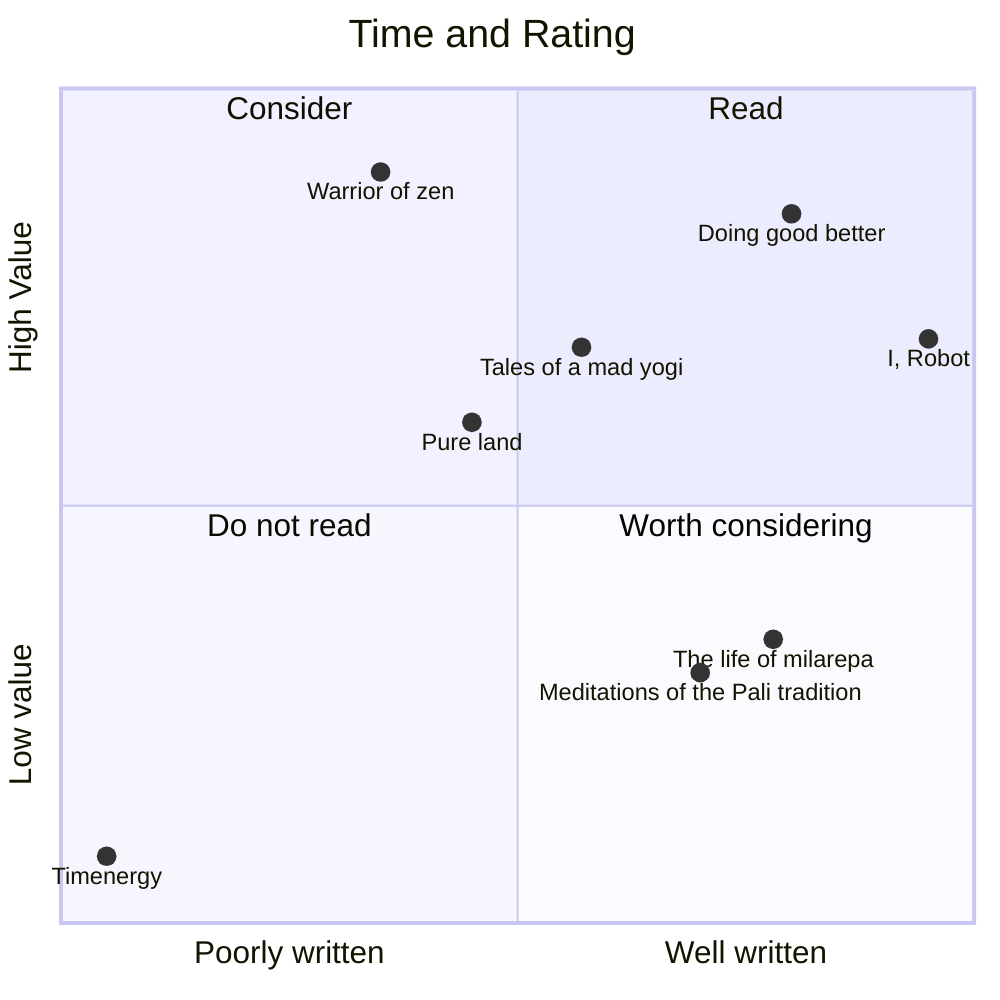

This chart will not contain all books I've read this year just a cluster

# Buddhism [10/11][90%]
- DONE Pure land, Jones
- DONE The life of milarepa
- DONE The buddhist and the ethicist
- DONE Meditations of the Pali tradition
- DONE Death was his koan
- DONE Entry into the inconceivable
- DONE The four sublime states
- DONE Dhammapada, Gil Fronsdal
- DONE Tales of a mad yogi
- DONE Warrior of zen

# Politics [7/7][100%]
- DONE Doing good better, MacAskill
- DONE Timenergy
  - Terrible, don't bother
- DONE Communist Manifesto
- DONE Postcapitalist Desire
- DONE Timenergy
- DONE Age of anxiety

# Philosophy [2/2][100%]
- DONE Dune and philosophy, Decker
- DONE Mans search for meaning

# Technology [2/5][40%]
- DONE Crypto Crackup, Bennington
- DONE The simulation unplugged, Zouev

# Fiction [1/1][100%]
- DONE Dharma Bums

# Science Fiction [1/1][100%]
- DONE I, Robot - Asimov
  - Really good

# Time log

  | Headline                              | Time       |      |
  |---------------------------------------|-----------|------|
  | **Total time**                        | **2d 8:38** |      |
  |---------------------------------------|-----------|------|
  | **Buddhism [10/11][90%]**             | 1d 7:47    |      |
  | \_ Pure land, Jones                   |           | 4:23 |
  | \_ The life of milarepa               |           | 5:13 |
  | \_ The buddhist and the ethicist      |           | 3:46 |
  | \_ Meditations of the Pali tradition  |           | 4:10 |
  | \_ Death was his koan                 |           | 4:41 |
  | \_ Entry into the inconceivable       |           | 3:15 |
  | \_ The four sublime states            |           | 0:59 |
  | \_ Dhammapada, Gil Fronsdal           |           | 1:08 |
  | \_ Tales of a mad yogi                |           | 2:07 |
  | \_ Warrior of zen                     |           | 2:05 |
  | **Politics [7/7][100%]**              | 8:50       |      |
  | \_ Communist Manifesto                |           | 1:03 |
  | \_ Postcapitalist Desire              |           | 4:00 |
  | \_ Timenergy                          |           | 2:15 |
  | \_ Age of anxiety                     |           | 1:32 |
  | **Philosophy [2/2][100%]**            | 7:03       |      |
  | \_ Dune and philosophy, Decker        |           | 3:46 |
  | \_ Mans search for meaning            |           | 3:17 |
  | **Technology [2/5][40%]**             | 0:53       |      |
  | \_ The simulation unplugged, Zouev    |           | 0:53 |
  | **Fiction [1/1][100%]**               | 3:46       |      |
  | \_ Dharma Bums                        |           | 3:46 |
  | **Science Fiction [1/1][100%]**       | 4:19       |      |
  | \_ I, Robot - Asimov                  |           | 4:19 |
